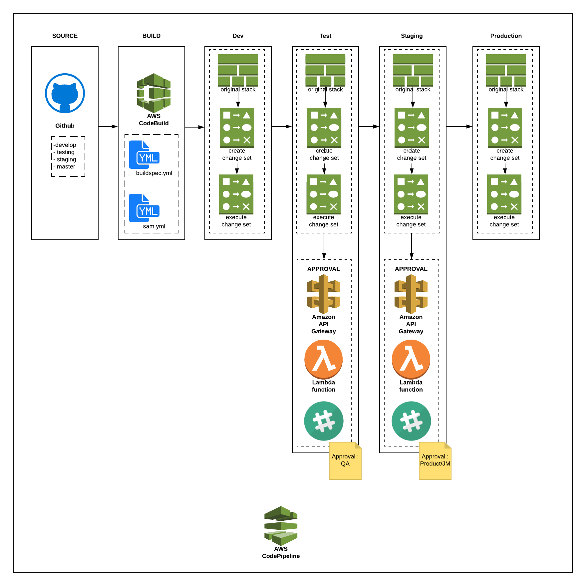
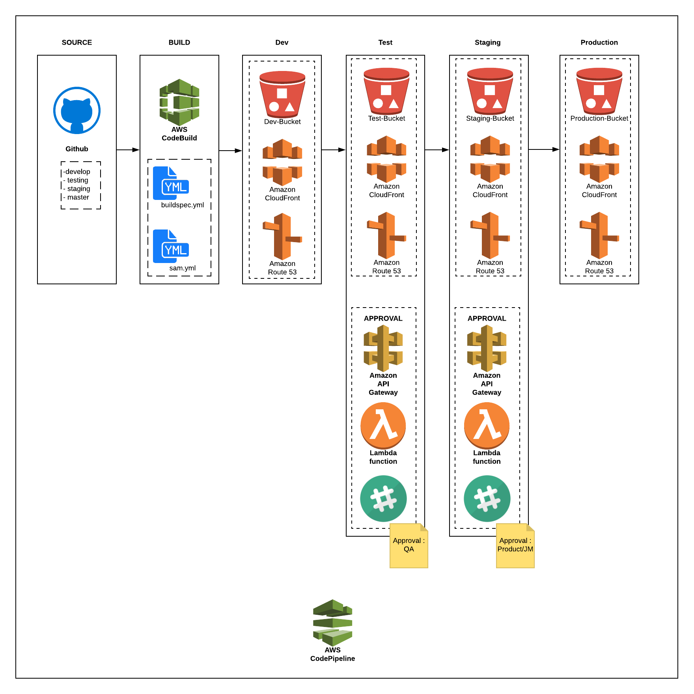

# Continuous Integration and Continuous Deployment

## Application Pipeline

### Lambda Deployment



### S3/Frontend Deployment



### Code Pipeline Stages

- Source

  - Pulls code from Code Repository and uploads it to Artifacts Bucket. There is a template for a Codecommit SCM and a Github SCM

- Build

  - As input, you must provide AWS CodeBuild with a build project. A build project defines how AWS CodeBuild runs a build. It includes information such as where to get the source code, the build environment to use, the build commands to run, and where to store the build output. A build environment represents a combination of operating system, programming language runtime, and tools that AWS CodeBuild uses to run a build
  - AWS CodeBuild uses the build project to create the build environment.
  - AWS CodeBuild downloads the source code into the build environment and then uses the build specification (build spec), as defined in the build project or included directly in the source code. A build spec is a collection of build commands and related settings, in YAML format, that AWS CodeBuild uses to run a build.

  sample buildspec.yml

```yaml
version: 0.2
phases:
    pre_build:
        commands:
            - sed -i.bak "s|APP_PORT|$APP_PORT|g" app/app.js
    build:
        commands:
            - aws cloudformation package --template-file sam.yml --s3-bucket $BUILD_OUTPUT_BUCKET --output-template-file output_sam.yaml

    post_build:
        commands:
          - echo "build completed on `date`"

artifacts:
    files:
        - output_sam.yaml
    discard-paths: yes
```

- The build environment uploads its output to an Amazon S3 bucket

