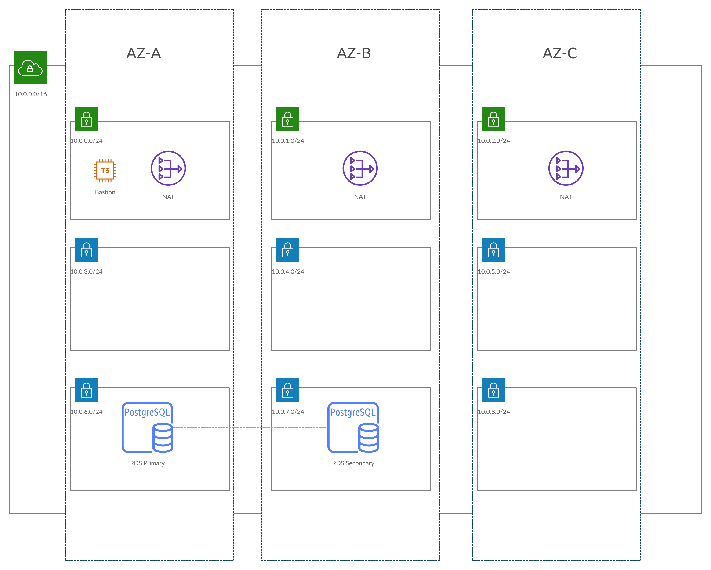

# Infrastructure

Uploading the main template should create an infrastructure that looks like this:

**Note:** This template is parameterized, so the final output is completely dependent on how you configure the template.

The EC2 instance is a bastion host with MongoDB installed. Feel free to use the following links to launch the stack. Note that it will launch in the **Singapore** region. If you want to launch it somewhere else, feel free to download the template, then upload it.

1. [Launch Main Stack](https://ap-southeast-1.console.aws.amazon.com/cloudformation/home?region=ap-southeast-1#/stacks/quickcreate?templateUrl=https%3A%2F%2Fzenon-cloudformation.s3-ap-southeast-1.amazonaws.com%2Fmain.yml&stackName=Demo&param_Changelog=Initial&param_CidrBits=8&param_CidrBlock=10.0.0.0%2F16&param_Environment=Dev&param_OfficeIp=103.104.16.78%2F32&param_ProjectName=Demo)
2. [Launch Network Stack](https://ap-southeast-1.console.aws.amazon.com/cloudformation/home?region=ap-southeast-1#/stacks/quickcreate?templateUrl=https%3A%2F%2Fzenon-cloudformation.s3-ap-southeast-1.amazonaws.com%2Fnetwork.yml&stackName=Demo-Network&param_Changelog=Initial&param_CidrBits=8&param_CidrBlock=10.0.0.0%2F16&param_Environment=Dev&param_OfficeIp=103.104.16.78%2F32&param_ProjectName=Demo)
3. [Launch Catdog](https://ap-southeast-1.console.aws.amazon.com/cloudformation/home?region=ap-southeast-1#/stacks/quickcreate?templateUrl=https%3A%2F%2Fzenon-cloudformation.s3-ap-southeast-1.amazonaws.com%2Fapplications%2Fcatdog.yml&stackName=Demo&param_Changelog=Initial&param_CidrBits=8&param_CidrBlock=10.0.0.0%2F16&param_Environment=Dev&param_OfficeIp=103.104.16.78%2F32&param_ProjectName=Demo)

